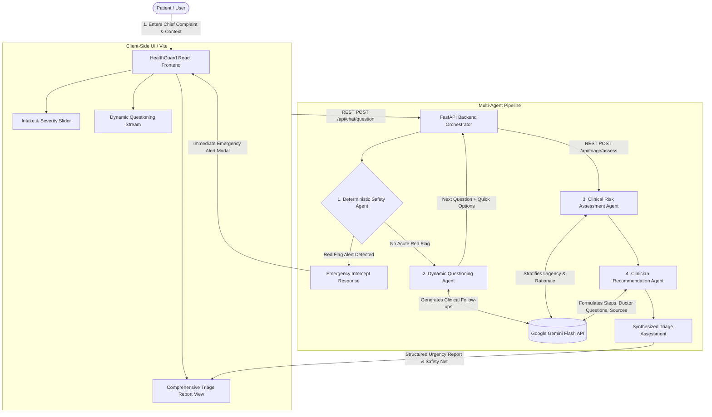

# HealthGuard — Agentic Clinical Risk & Triage

An AI-powered, safety-first clinical decision-support and triage platform designed to evaluate early health symptoms, assess urgency levels, and guide users toward the appropriate care pathway.

---

## 1️⃣ Project Name & Problem Statement – What problem are you solving?

### Project Name
**HealthGuard — Agentic Clinical Risk & Triage**

### Problem Statement
* **The Healthcare Navigation Crisis**: When feeling unwell, individuals frequently turn to search engines and generic online symptom checkers. They are routinely bombarded with alarmist, confusing, and contradictory information that induces anxiety without providing clear direction.
* **The Twin Hazards of Delay and Overcrowding**:
  * **Delayed Intervention**: Patients experiencing subtle or atypical warning signs of life-threatening events (e.g., myocardial infarction, early stroke signs, sepsis) often minimize their symptoms and delay seeking critical emergency care.
  * **Emergency Department Strain**: Conversely, patients overwhelmed by anxiety frequently visit emergency departments for mild, self-limiting ailments that could be safely managed through outpatient clinics, routine telehealth consultations, or supported home monitoring.
* **The Diagnostic Fallacy**: Traditional symptom checkers attempt to deliver definitive medical diagnoses. In a digital triage setting, this is inherently unsafe and misleading. Patients do not need an AI-generated speculative diagnosis; **they need to know how urgent their condition is, what risks exist, and what responsible next step to take.**

---

## 2️⃣ Problem Solution – How does your app solve it?

HealthGuard replaces speculative diagnoses with an **orchestrated 4-agent clinical triage pipeline** that combines deterministic safety guardrails with generative AI reasoning:

### 1. Fast-Path Deterministic Safety Guardrail
* Evaluates patient inputs immediately against clinically validated red-flag patterns (e.g., chest discomfort with radiation to the arm/jaw, acute dyspnea, FAST stroke signs, anaphylaxis, severe hemorrhage).
* If acute danger is detected, it **immediately halts lengthy questioning** and displays an emergency alert modal advising immediate contact with emergency dispatch services (e.g., 911 / 999 / 112).

### 2. Conversational Dynamic Questioning
* Rather than imposing an exhaustive, static questionnaire, the **Dynamic Questioning Agent (powered by Google Gemini Flash)** formulates one high-yield clinical clarification question at a time.
* It adapts based on prior answers, duration, reported pain level (1–10), and demographic context (age group, pregnancy status, underlying conditions).
* Provides interactive **Quick-Reply Option Chips** to minimize cognitive fatigue, capped at a maximum of 3 turns to prevent user delays.

### 3. Objective Clinical Risk Stratification
* The **Risk Assessment Agent** categorizes the user’s condition into one of four calibrated urgency tiers:
  1. **Emergency Care Now** *(Immediate emergency services / ED visit)*
  2. **Seek Care Today** *(Same-day clinical evaluation within 12–24 hours)*
  3. **Arrange Care Soon** *(Routine primary care or telehealth visit within 2–3 days)*
  4. **Self-Care & Monitor** *(Supportive home care with explicit safety-net guidance)*
* Generates a transparent, plain-language **Clinical Rationale Breakdown** explaining the exact factors that influenced the urgency score.

### 4. Actionable Clinician Communication & Safety-Net Guide
* The **Clinician Recommendation Agent** equips the user with actionable next steps:
  * **Escalation Triggers**: Explicit red flags that should prompt immediate escalation if symptoms worsen.
  * **Questions for Your Doctor**: Structured prompts patients can bring to their appointment.
  * **Diagnostic Tests to Discuss**: Non-prescriptive point-of-care laboratory or imaging tests to mention to their physician.
  * **Authoritative Medical References**: Direct links to trusted public health sources (e.g., NHS UK, MedlinePlus).

---

## 3️⃣ Technology Stack – Tools, frameworks & platforms used

| Layer | Technology | Role & Purpose |
| :--- | :--- | :--- |
| **AI & LLM Engine** | **Google Gemini (`gemini-2.5-flash`)** | Natural language clinical reasoning, dynamic follow-up questioning, and tailored triage recommendations via the official Google GenAI SDK (`google-genai`). |
| **Deterministic Fallback Engine** | **Python Rule Engine** | Offline, sub-millisecond heuristic safety net that intercepts emergencies and guarantees continuous operation if the AI model encounters rate limits or network latency. |
| **Backend Framework** | **Python 3.10+ / FastAPI** | Asynchronous, high-throughput REST API coordinating the multi-agent pipeline and managing CORS, schemas, and endpoints. |
| **Data Validation & Schemas** | **Pydantic v2** | Strict typing for chat messages, patient demographic context, question structures, and multi-agent clinical assessment responses. |
| **Web Server (ASGI)** | **Uvicorn** | High-performance ASGI server binding to `127.0.0.1:8000`. |
| **Frontend Framework** | **React 19 & TypeScript** | Component-driven, type-safe single-page application (SPA) with responsive UI states and real-time agent status tracking. |
| **Styling & Design System** | **Tailwind CSS & CSS Variables** | Modern, clinical-grade user interface with high-contrast urgency badges, accessible color palettes, and fluid transitions. |
| **Icons & Visuals** | **Lucide React** | Medical and navigational iconography (`HeartPulse`, `ShieldAlert`, `Stethoscope`, `Clock3`, `TriangleAlert`). |
| **Routing** | **Wouter** | Minimalist, client-side routing between Home, Assessment Interview, and Triage Report views. |
| **Build & Dev Tooling** | **Vite & pnpm** | Lightning-fast development server, HMR, and optimized production bundler. |
| **Automation & Scripts** | **PowerShell & Batch** | Windows-native one-click launchers (`run_backend.ps1`, `run_frontend.ps1`, `run_backend.bat`, `run_frontend.bat`). |

---

## 4️⃣ High-Level Diagram – How your system components communicate

### Architectural Interaction Flow



### Component Data Exchange

```
[User Browser]
       │
       ▼
[React 19 Frontend (Vite @ port 5173)]
       │  HTTP Fetch (15s Timeout / AbortController Guard)
       ▼
[FastAPI Backend (@ port 8000)]
       │
       ├──► 1. SafetyAgent.check_red_flags() ──[CRITICAL RED FLAG?]──► Immediate 911 Alert
       │         (Deterministic Keyword & Pattern Matcher)
       │
       ├──► 2. QuestioningAgent.get_next_question()
       │         (Context-Aware Gemini Flash Prompt / Structured Output)
       │
       ├──► 3. RiskAgent.assess_risk()
       │         (Assigns Emergency / Same-Day / Soon / Self-Care + Rationale)
       │
       └──► 4. RecommendationAgent.generate_recommendations()
                 (Action Steps + Escalation Triggers + Doctor Prompts + MedlinePlus/NHS Links)
```

---

## 🚀 Quick Start Guide

### Prerequisites
* **Python 3.10+** (virtual environment located at `venv/`)
* **Node.js v18+** with `corepack` / `pnpm`
* A **Google Gemini API Key** (configured in `backend/.env`)

### Configuration
Ensure `backend/.env` contains your Gemini API key:
```env
GEMINI_API_KEY=your_actual_gemini_api_key_here
PORT=8000
GEMINI_MODEL=gemini-2.5-flash
```

### Launching the Application

#### Option A: Using Windows PowerShell (Recommended)
**Terminal 1 (Backend)**:
```powershell
.\run_backend.ps1
```

**Terminal 2 (Frontend)**:
```powershell
.\run_frontend.ps1
```

#### Option B: Using Batch Files
* Double-click `run_backend.bat`
* Double-click `run_frontend.bat`

#### Option C: Manual Terminal Commands
**Start Backend**:
```bash
.\venv\Scripts\activate
python -m uvicorn backend.main:app --host 127.0.0.1 --port 8000 --reload
```

**Start Frontend**:
```bash
corepack pnpm --filter @workspace/healthguard run dev
```

Open your browser to: **`http://localhost:5173`**

---

## ⚠️ Medical & Responsible AI Disclaimer

HealthGuard is an artificial intelligence-assisted clinical decision-support and triage prototype designed strictly for educational and informational purposes. It is **not** a certified medical diagnostic device and does not establish a physician-patient relationship. It does not provide medical diagnoses, clinical prescriptions, or treatment plans. If you believe you are experiencing a life-threatening medical emergency, call your local emergency response number (e.g., 911, 999, 112) or proceed to the nearest emergency medical facility immediately.
# Agentic_ai_Health

